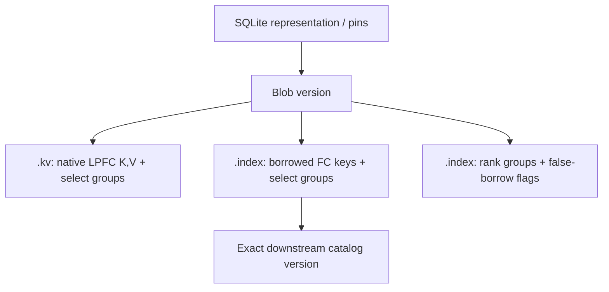

# Everett design

Updated 2026-09-15.

I am building Everett around immutable blobs, composable updates, shared merge
work and persistent logical states. Here I describe the intended design of this
dynamization store. Public prototype headers are under `include/everett/`;
the [implementation ledger](implementation.md) distinguishes executable
components from the remaining storage and scheduling work.

I use locality-preserving front coding (LPFC) as the safe native-key baseline.
The fractional index's known group boundaries let us remove some reconstruction
redundancy in a separately rebuildable index codec. Ordinary front coding (FC),
native LPFC and conservative borrowed-prefix policies have different context
contracts. We still need to measure and justify their combined space and I/O
costs; one local decoding result does not establish those bounds.

## 1. Purpose and abstraction

I use the following vocabulary for the intended aggregates:

- A **multiverse** owns backing storage and the immutable objects shared by its
  worlds, timelines and retained references.
- A **world** is a logical state, independent of its current physical layout.
- A **timeline** is an ordered progression of worlds.
- A **branch point** is a retained point from which a timeline can continue or
  fork; `branch_point` is the intended API spelling.

`multiverse<P>` implements the read side of an existing object directory and
exposes `sort`, `blob`, `file`, `world`, `timeline` and `branch_point` associated
types carrying the same policy. Persistent worlds/timelines remain design work;
their aggregate types are forward declarations. The semantic oracle is
`reference_world`. The [SQLite catalog](catalog.md) is the selected home for
worlds, pins and merge/index-rebuild progress.

I represent a world as a small collection of immutable, memory-mappable blobs.
Updates produce small new blobs; merges produce new larger blobs. A snapshot or
save pins an exact collection and the dependencies needed to query it. A save
adds durable retention to that logical snapshot; it does not define a separate
kind of application state.

I want the outer dynamization mechanism to apply beyond maps. Its reusable
requirements are a merge operation, a query operation, and rules relating them.
I am leaving the exact monoid/homomorphism interface open until its consumers
need one. The typed blob specialization supports byte or bit keys and opaque fixed-
or variable-width values. The replacement oracle uses fixed-width values and
tombstones. The intended key space is sort-qualified: each logical
key combines a sort identity with a key interpreted by that sort's policy.
[Sorts and key policies](keys.md) specifies key units, canonical ordering,
prefix-free coding and hash-policy selection. The byte-key encoding below is a
starting point; it does not yet implement the sort envelope. The general update
model allows a category chosen per full logical key: records carry composable
arrows, and omission means the identity update.
[Updates in a category chosen per key](arrows.md) specifies that
model, its nerve interpretation, and the additional cost and retention contracts.
The replacement-specific rules below remain the implemented first instance.

I started from my
[Data.Vector.Map](https://hackage.haskell.org/package/structures-0.2/docs/Data-Vector-Map.html)
and [Data.Vector.Map.Deamortized](https://hackage.haskell.org/package/structures-0.2/docs/Data-Vector-Map-Deamortized.html).
That functional numeral scheme motivated immutable merges and shared work.
Here I adopt **COLA-style redundant levels** in place of the initial zeroless,
mostly-oneless binary presentation.

Logical state and physical representation have different identities. Two peers
can have the same table and its composite fingerprint while retaining different
files, index versions, and completed compactions.

### Notation

| Symbol | Meaning |
| --- | --- |
| $N$ | Number of live bindings in the selected world |
| $H$ | Historical updates; distinct from live size |
| $L$ | Number of active levels/catalogs |
| $K$ | Policy sampling/group size $2^r-1$, default 15; 3, 7, 15 and 31 tested |
| $A$ | Sorted native key/value stream of one blob |
| $S$ | Sorted borrowed-key stream of its fractional index |
| $C$ | Virtual sorted interleaving of $A$ and $S$ |
| $U$ | Residual extent in policy units used by an Elias–Fano encoding |
| $v$ | Fixed value width in policy units, common across the indexed stream |

An index targets the next catalog's **augmented** ordering, including borrowed
entries. Sampling only its native keys would not establish the stated windows.

## 2. The blob

I define a blob as the following logical composite; its pieces need not occupy
one file:

1. A front-coded array of native $(K,V)$ records.
2. A separately front-coded array of borrowed keys and routing information.
3. One `rank_groups<K>` describing their virtual interleaving.
4. Two `select_groups<K>` indexes, one for each physical stream.
5. One false-borrow flag per borrowed record.
6. Exact immutable target identities and format information.



I keep native data shareable across fractional-index versions. We can rebuild an
index without inherently rewriting the native stream or its sampled offsets.
Pointers in persisted objects are relative positions or object references, not
process addresses. File-per-object versus managed extents remains an allocation
decision below this interface.

The current byte-key instance has a specified unsigned-byte lexicographic order,
including empty keys and embedded zero bytes. Encoded records carry lengths;
zero bytes need not be reserved as terminators. General sort-qualified keys must
also satisfy the canonical ordering and framing contract in [keys.md](keys.md);
that interface is not implemented by the byte-string prototype. The initial
fixed-width-value format retains a value slot for tombstones so record stride
remains predictable.

Native keys are unique within each blob. In the categorical extension, one
entry holds a composite arrow for a consecutive portion of that key's history;
merges preserve this uniqueness. The logical table also has one configuration
per key: history occurrences are not independently mutable duplicate members.
Distinct members need distinct logical addresses to identify the old value for
deletion/replacement accounting. Indistinguishable unit-valued duplicates are
multiplicity, represented by one natural-valued binding instead of unary copies.
The [arrow design](arrows.md#logical-key-identity-and-multiplicity)
distinguishes live keys, multiplicity, and their fingerprints.

## 3. Navigation

We can work through the navigation equations with the default $K=15$,
including the original `rank15`/`select15` prototypes. Typed codecs generalize them to policy groups;
[sampling.md](sampling.md) proves the local $K=3$ case and states the separate
chain-size and scheduler assumptions. Offset units are bytes or bits according
to the shared policy.

### rank15

We assign a conceptual origin bit of one to a borrowed entry and zero to a
native entry. We only need ranks at sampling boundaries:

$$
R(g)=\operatorname{rank15}(g)=
\#\{\text{borrowed entries before }\min(15g,|C|)\}.
$$

For a full virtual window $[15g,15(g+1))$, its borrowed range is
$[R(g),R(g+1))$, and its native range is
$[15g-R(g),15(g+1)-R(g+1))$. Substitute the actual final endpoint for a tail.
The two range lengths add to at most fifteen.

I store each fifteen-entry population count in four bits: its value is in
$[0,15]$. A prefix directory answers the boundary queries. There is no second
origin rank: native rank is virtual position minus borrowed rank.

The optional exact-position extension is the RRR class/offset idea: a class
$i$ identifies the count, and an enumerative code of
$\lceil\log_2 {15\choose i}\rceil$ bits identifies the particular pattern.
Ordinary cascading does not require that extension.
See [Raman, Raman, and Rao](https://arxiv.org/abs/0705.0552) for the general
succinct-dictionary machinery.

### Pragmatic rank-only backend

For general bitvector rank, I use a deliberately pragmatic layout:

- One 64-bit absolute count per $2^{32}$ source bits.
- One 32-bit count relative to that epoch per 2048 source bits.
- Three packed 10-bit **individual population counts**, for the first three
  512-bit runs within the 2048-bit block.
- Sum the preceding lanes using word-parallel arithmetic; popcount the remaining
  portion of the selected 512-bit run.

The three lanes are not cumulative: a cumulative count through three full runs
could be 1536 and would not fit in ten bits. The 32-bit counter and packed lanes
fit together in 64 bits, giving 3.125% directory overhead plus the sparse epoch
counts. We need only rank from this backend, so I do not require select.
The layout corresponds to the rank portion of
[Zhou, Andersen, and Kaminsky's Poppy design](https://www.cs.cmu.edu/~dga/papers/zhou-sea2013.pdf).

I keep this bitvector backend distinct from the packed fifteen-entry class stream:
15 does not divide 512 or 2048. Its class-prefix directory must specify its own
aligned units; a class cannot answer an arbitrary cut through its fifteen bits.
The first implementation makes this distinction explicit rather than storing
unneeded origin patterns.

### select15 and fixed-width values

For each stream independently, I mark physical records $0,15,30,\ldots$, plus
the end sentinel, and store their normalized byte positions using Elias–Fano.
For record ordinal $i_g=\min(15g,n)$:

$$
F_g=\operatorname{physicalOffset}(i_g)-i_gv,\qquad
\operatorname{select15}(g)=\operatorname{base}+F_g+i_gv.
$$

The Elias–Fano universe $U$ measures the variable encoding, excluding fixed
value slots and any other fixed stride removed this way. The width $v$ must
be common to the entire indexed stream; widths fixed only within individual
sorts do not establish one global stride. The terminal sentinel
uses $n$, not fifteen times a rounded-up group count. Residual offsets may be
equal; the encoding accepts nondecreasing sequences.

With $m$ marked offsets, the representation uses approximately
$m\log_2\max(1,U/m)+O(m)$ bits plus its access support.
[Vigna's description](https://vigna.di.unimi.it/ftp/papers/QuasiSuccinctIndices.pdf)
explains the high/low-bit encoding and its use for prefix sums.
The address operation `select15` is separate from the rank-only origin backend.

A virtual window projects to arbitrary physical ordinals. We find the preceding
physical group with $\lfloor i/15\rfloor$, then inspect at most fourteen record
headers, skipping payloads by length. Each projected slice touches at most two
physical groups. These marks are navigation points, not full-string restarts.

### False borrows and equality

A borrowed key also present in the native array is a **false borrow**. During
index construction, a merge of the two key streams determines a flag for every
borrowed entry. I keep that flag attached to its particular index version.

An equal borrowed key must not make a native value disappear behind a search
fence. On such a hit, the flag says to account for the local native binding as
well as continuing downstream routing. A native tombstone still counts as a
native occurrence. The flag does not change an entry's origin for `rank15`.

The concrete tie order and boundary recovery operation are part of the tested
query contract. A flag establishes existence; recovering the value must use
bounded ordinal/window arithmetic rather than silently starting a full search.
Tests must place the native/borrowed equality pair on both sides of a group cut.

## 4. Front coding and decoding context

The original byte-only prototype's record format is:

```text
retained_prefix_length : unsigned variable-length integer
suffix_length          : unsigned variable-length integer
suffix_bytes           : byte[suffix_length]
value                   : fixed-width slot
```

The typed profiles store the actual **backspace count** instead of the retained
prefix length. One predecessor-length checkpoint per physical group supports
decoding from a surrogate anchor without a full-length field on every record.
Headers use byte varints or bit-level order-zero exponential-Golomb codes.
Variable-width streams also encode value lengths; a proven common width removes
that field and its fixed payload stride from sampled residual offsets.
`profile_blob<P>` applies native LPFC (default factor 18) and the separately
modified borrowed FC. These are encoded stream primitives; portable sections
inside `.kv`/`.index` envelopes are not yet implemented.

In this byte-profile format, retained-prefix and suffix lengths count bytes.
For ordinary front coding, the retained length is the LCP with the previous
physical key. For a redundant representation it may be shorter; the erased
letters are explicitly re-emitted. Such a retained length must never be
mislabelled as an exact LCP.

To compare with $q$, we reconstruct at most
$\min(|q|,|s|)$ bytes of a candidate $s$. If those prefixes agree, stored
lengths resolve ordering/equality. I retain explicit partial-key state:
known prefix, full length, and comparison context.

### Anchored decoding and its limits

A cascaded window starts with a key already known from above. This supplies
forward-decoding context. If a physical predecessor is $x$, the incoming
anchor is $a$, and the next physical key is $y$, then
$x\le a\le y$ implies that $a$ contains the common prefix of $x$ and $y$.
The argument works independently for both projected streams.

For this local forward window, a lookup need not walk backward to an older
full-string restart. It visits at most fifteen candidate entries, materializing
only query-relevant prefixes. I accept an extra factor of the number of levels
in string work: the target is $O(|q|L)$ key-byte work.

That local argument is not by itself the complete context-transfer protocol.
If no borrowed key in the window precedes the query, the outgoing borrowed
predecessor may be just before the window. Its ordinal is known, but its prefix
need not equal the incoming anchor. A cascade must retain or repair that
borrowed-frontier context, not silently decode from the beginning of the file.

We can bootstrap with a single-entry literal root, or use LPFC in the first catalog.
The original LPFC construction is in
[Bender, Farach-Colton, and Kuszmaul, §3.2](https://people.csail.mit.edu/bradley/papers/BenderFaKu06.pdf#page=6).
It provides independent local reconstruction through selective full-key copies.
The paper's printed $c=2+\varepsilon/2$ disagrees with its charging equation
$2/(c-2)=\varepsilon$; the latter gives $c=2+2/\varepsilon$.

### The first-record LCP distinction

Consider:

```text
actual native predecessor  aa
incoming boundary key      ab
first native candidate     abc
query                      abd
```

The stored prefix length is one; the query/anchor LCP is two. The candidate is
still below the query. An optimization that treats the incoming anchor as the
actual predecessor could incorrectly conclude the opposite.

The correct baseline compares the first candidate using the supplied prefix
and its suffix. Once advancing through consecutive records of that physical
stream, exact-predecessor optimizations become available. This is a correctness
rule, not a reason to restore full-key reconstruction.

### Current candidate: native LPFC, conservative index front coding

The data file may know its initial borrowed-key layout when it is created.
However, rebuilding an index farther along the chain can change that layout.
The native encoding must remain usable when these dependent boundaries move.

I split the native and index codecs as follows:

- I use full LPFC for the native data, with restart decisions independent of any
  particular fractional-index version.
- I use the conservative fifteen-entry common-prefix rule for the fractional
  index, which can be rewritten when its exact target/index dependencies change.
- I keep ordinary anchored decoding as the fast path when its context is already
  available, and as a simple correctness baseline.

LPFC is the safe fallback. The index rule exploits the known windows to repeat
only the prefix material required for context transfer. The construction below
provides a concrete independently rebuildable candidate.

### Conservative common-prefix alignment

A conservative alignment rule backspaces to the common prefix of the
two string sets at each shared fifteen-entry boundary, re-emitting removed
letters as needed. This aligns the two decoding contexts. These are boundaries
in the virtual interleaving, not unrelated physical group boundaries.

The two keys are the **native and borrowed frontier keys at the cut**.
They are not the first and last keys of the upcoming window. For a boundary
prefix ceiling $c$ and an ordinary retained length $p$, a
redundant encoding may retain $\min(p,c)$ and emit the remaining letters.
The retained length describes an edit; comparison shortcuts still require a
proved exact LCP or a separately established comparison context.

Both frontier contexts matter: the preceding borrowed key may be needed for the
next descent even when the current projected borrowed slice is empty.
I want to avoid copying a long prefix every fifteen native entries merely
because an unchanged, distant borrowed frontier has an unrelated key. We need
to count actual replay bytes and skip alignment work whose context is not needed.

I require native files to remain independently reusable when an index changes.
Full native LPFC is the conservative choice above. A more aggressive alternative
is an index-local bridge: when $p>c$, we could keep the replayed
$s[c:p]$ bytes in the new index, followed logically by the unchanged native
suffix. We would charge those bridge bytes to that index version. I am still
evaluating the exact boundary-edit representation and redundancy bound; it must
preserve native-file independence.

### A concrete index-only construction

Let $a_j=\operatorname{lcp}(S_{j-1},S_j)$, with $a_0=0$.
We can obtain a simple conservative encoding by retaining
$\min(a_j,a_{j+1})$ bytes of borrowed record $S_j$; define
$a_m=0$ for the last record's right boundary. It can decode that record from
either a lower anchor between its predecessor and itself, or an upper anchor
between itself and its successor. The last borrowed record is literal.

For the troublesome preceding borrowed key, the incoming window anchor is on
that upper side. One additional record probe reconstructs its query-relevant
prefix without a backward prefix-chain walk. This repairs the outgoing context
while leaving the native stream unchanged. The first post-cut borrowed key still
decodes from the same anchor in the usual forward direction.

The sharper version applies this rule only at actual virtual fifteen-entry
cuts. A cut at $15g$ whose borrowed rank is $j+1$ may need $S_j$ as its
preceding borrowed key. Let $b_j$ be the rightmost such cut's boundary key.
We retain $\min(a_j,\operatorname{lcp}(S_j,b_j))$; if no such cut exists, we retain
the ordinary $a_j$. Prefix convexity makes the rightmost cut the tightest
constraint. The borrowed builder knows these cuts when it merges native and
borrowed keys, and can recompute them when the index changes.

We can derive a simple suffix-byte bound for this candidate. Ordinary borrowed FC
emits $F=\sum_j(|S_j|-a_j)$ bytes. The two-sided rule adds
$D=\sum_j\max(0,a_j-a_{j+1})$. With zero endpoints, total falls equal total
rises, and every rise $a_{j+1}-a_j$ is at most $|S_j|-a_j$. Thus
$D\le F$, so at most $2F$ borrowed suffix bytes are emitted. The actual-cut
rule is no more redundant: each applicable cut lies before the next borrowed
key. Header sizes, rank/offset support, and any extra caller-imposed prefix
ceilings are charged separately. This is our derivation for this design, not a
theorem attributed to the COSB-tree paper.

The implementation ledger records which policies are tested. This establishes
local context transfer and a borrowed-suffix bound; it does not establish a
complete persistent-store space or I/O theorem.

## 5. Redundant levels and merge work

My scheduling reference is
[Cache-Oblivious Streaming B-trees, §3](https://people.cs.georgetown.edu/~jfineman/papers/sbtree.pdf).
Its deamortized COLA uses redundant arrays and prioritizes small unsafe levels.
Data merging and lookahead construction both participate in becoming safe and
in switching visibility. Its exact schedule and bounds are useful starting
points, not a proof for arbitrary extra compactions or persistent retention.

I want the store to keep $O(\log N)$ active blobs, with a bounded number per
level. Small updates pay for later merging and index construction. Work may be
performed during downtime as well as on arrivals; logical state does not depend
on the amount of compaction already completed.

Network admission retains received content-addressed `.kv` bytes unchanged,
including their LPFC stream and sampled offsets. We build receiver-specific
fractional indexes backward over the incoming prefix and retain the old suffix.
Received `.index` objects are reusable only with matching exact source/target
versions. Native re-encoding waits for a real merge. The
[admission analysis](network-admission.md) gives the arbitrary-file-size entry
bound and identifies the remaining scheduling and variable-key-byte obligations.
No power-of-two physical-file requirement follows from the query argument;
the original redundant-counter schedule still requires an admission proof.

I separate the work into these milestones:

1. A merge recipe identifies exact inputs and resolution semantics.
2. Its new native stream and sampled offsets finish.
3. A dependent pins that result.
4. The dependent completes its own borrowed stream, group ranks and sampled offsets.
5. It publishes its replacement index and SQLite representation, then releases its old references.

String work needs explicit units: records visited, bytes compared, bytes emitted,
and index work. A scheduler yielding once per record can still stall on a huge
key. Continuations retain input prefix context, previous output context, cursors,
and partial comparison/write state.

We cannot assume that an input's compressed size pays for full expansion of
every string. LCP-aware merging is relevant here;
[Bingmann, Sanders, and Schimek, §II-B](https://panthema.net/2020/0518-distributed-string-sorting/2001.08516v1-Communication-Efficient-String-Sorting.pdf)
describes carrying LCP information through multiway merging and communicating
prefix-compressed strings. Adapting that technique and measuring actual work
is a separate implementation milestone.

Elias–Fano construction also needs accounting: final record count and variable
extent can be known late. Spooling group offsets and finalizing the compact
index after the data pass is a simple initial strategy.

## 6. Snapshots, saves, and shared work

By manifest I mean the logical selection recorded by SQLite rows, with exact
immutable representation identity. There is no custom manifest/checkpoint file
format. The [catalog](catalog.md) and [file lifecycle](file-lifecycle.md) separate
transactional metadata from the `.kv` and `.index` objects it retains.

A snapshot pins the exact blob/index graph needed to read its world. A durable
save records that manifest and retains those pins across process lifetimes.
Readers hold references protecting their mappings; replacing a manifest does
not invalidate an in-flight read.

Suppose a dependent indexes old targets $X,Y$, while another branch finishes
$Z=\operatorname{merge}(X,Y)$. The dependent continues using $X,Y$: its
fractional index describes those exact layouts. It may immediately pin $Z$,
skip the data merge work it was budgeted to perform, and spend its own schedule
on index repair. Only then does it adopt $Z$.

I call this **shared completion with independent adoption**. It preserves snapshots
and avoids making all forks compact in lockstep.

Pins cover readers, saved manifests, builders, and cached results in use.
Lookup-and-retain of a cached merge must be atomic with respect to reclamation.
Construction references transfer to a published manifest before being released.
Cancellation has a corresponding release path.

### The pin-set owner

I give the current world one immutable pin-set owner. Each entry records an
exact object identity, its lifetime pin, its local additive contribution, and optionally its
own-native-record fingerprint. The owner caches the sum of the contributions;
this sum is the world's composite key. A snapshot shares the owner. Updating or
compacting constructs a replacement owner without changing previous snapshots.

The contribution is defined by the entry's role: a base contributes its table
fingerprint, an update contributes its validated old-to-new delta, and a merge
contributes the sum of the entries it replaces. A tombstone-only update can have
zero native fingerprint and a nonzero negative contribution. Section 8 defines
the algebra. Index-only dependencies retain objects but contribute no bindings.

Physical replacement checks that all expected input identities are present and
that the replacement contribution equals their sum before publishing the new
owner. Equality of this weak sum is a lint check, not proof that a merge is
correct. Record precedence and exact index dependencies must also be preserved.
An in-memory shared pointer provides lifetime safety; durable saves additionally
need a persisted root and recovery protocol.

### Durability and resumption

I require publication to preserve the last acknowledged save through a failed
durability barrier. A completed merge is first a candidate output. We make its
contents and object-store metadata durable, then publish a durable manifest that
references it, and only then retire the old root's pins. Other snapshots,
readers, index dependencies and resumable jobs can still retain the old inputs.

I keep resumable work separate from published worlds. A merge checkpoint names its
exact recipe and immutable inputs, input positions and prefix contexts, a
verified output prefix, and the state needed to resume output encoding and index
construction. Checkpoint publication must follow the durable bytes it describes.
If no trustworthy checkpoint survives, recompute from the retained inputs.

I treat an `fsync` error as a failed durability assertion. We retain the old
durable root and inputs, quarantine uncertain output, and report the failed save
or checkpoint. A later successful `fsync` alone does not justify releasing
those pins or claiming durability.
The detailed protocol, filesystem assumptions and failure tests are specified in
[Durability and merge resumption](durability.md).

A merge cache key includes exact inputs plus any precedence, format, or
tombstone-elision context affecting the output. If elision requires coverage of
older records outside the inputs, include that coverage in the recipe or retain
the tombstone in the reusable result.

The logical fingerprint is not the identity of a particular physical layout.
Immutable object identities and format versions serve that purpose.

## 7. Strong deletes and live-universe rebuilding

Here I give the concrete cleanup rule for replacement-valued records.
Arbitrary arrows require a category-specific clean representation and work bound;
materializing an endpoint must preserve every supported future observation and
update before history can be forgotten. See the
[categorical extension](arrows.md#6-blobs-pins-checkpoints-and-strong-deletion).

I use the weak-to-clean update transformation in **Overmars and van Leeuwen,
§2, Theorem 1**, adapting its OLD-MAIN, MAIN and buffered-update roles to immutable
manifests. Their November 1980 report is RUU-CS-80-10; the journal publication
appeared in 1981.
[Author report](https://ics-archive.science.uu.nl/research/techreps/repo/CS-1980/1980-10.pdf#page=5);
[journal DOI](https://doi.org/10.1016/0020-0190(81)90093-4).
The [rebuild protocol](rebuild.md) gives the accounting and adaptation
in detail. Global rebuilding is separate from ordinary COLA level merges.

Native records represent $(K,\operatorname{Maybe} V)$; `Nothing` is a tombstone.
Newer records shadow older records. A genuine delete requires knowing that the
old binding existed. An absent-key tombstone earns no deletion credit. We count
live bindings separately from weak mutations: overwrites also grow physical history
and must contribute to the cleanup schedule.

### Generation state and trigger

Each generation records its clean base cardinality $b$ and the number $u$
of admitted key mutations since that base's freeze cut. **Replayed mutations
count toward $u$**. I choose to start rebuilding at
$u\ge\lfloor b/4\rfloor$, early enough to finish before half the base could disappear.
These constants are our adaptation, not the constants printed in the paper.
Tiny generations use a bounded direct rebuild rather than fractional counters.

1. **Freeze.** We pin a complete world manifest at an admitted update cut and keep
   the serving generation current while this pinned source remains unchanged. Let
   $n_s$ be the source's live cardinality.
2. **Build clean contents.** We merge the frozen native streams with full older
   coverage, emitting only each key's newest live binding. We discard the frozen
   tombstones and shadowed versions, and construct the replacement's fractional
   indexes against its exact new catalogs.
3. **Capture and replay.** Every later admitted mutation updates the serving
   generation and enters an ordered replay queue. After clean construction,
   we apply that queue to the replacement, retaining causal order for each key.
   Queries continue using the serving generation throughout.
4. **Catch up and adopt.** When the queue is empty at an admitted cut and all
   replacement indexes are ready, we compare live count and composite fingerprint,
   then publish the new owner. The new counters are $b=n_s$ and
   $u=\text{replayed mutations}$, not zero. Durable adoption follows the
   publication protocol; other snapshots keep their old pins.

### Why catch-up finishes

Let $R$ bound the complete frozen rebuild work. We choose a deadline of
$h=\lfloor n_s/8\rfloor$ admitted key mutations. Mutation $i$ requires at
most $w_i$ work to replay, including its replacement-side merge/index work.
In addition to applying it to the serving generation, we give the background job
$R/h+w_i$ work. We spend this on construction until construction finishes, then
on FIFO replay. Its unfinished work decreases by at least $R/h$ per admission
until it reaches zero. Thus the queue is caught up by $h$, without assuming
that a late, arbitrarily large replay pass will somehow finish.

At adoption, replay debt is at most $\lfloor n_s/8\rfloor$, below the next
generation's $\lfloor n_s/4\rfloor$ trigger. There is fresh slack for the next rebuild. Counting individual
key mutations makes this argument apply to large changeset blobs; counting each
whole blob as one update would not fund its work.

The result is an active represented universe within a constant factor of live
$N$, so the level bound follows live size instead of lifetime update count.
New mutations can introduce new tombstones while a rebuild is running; the
claim is timely removal of accumulated history, not a simultaneously
mutation-free physical image at every publication cut. Repeated overwrites
trigger the same rebuilding mechanism even when live cardinality is unchanged.

For strings, $R$ includes actual scanning, reconstruction, output, index and
checkpoint work. It must cover the frozen physical representation, not just
count live keys. A long unchanged key can make $R/h$ large even when the
incoming deletions are short. The scheduler needs explicit byte/work budgets;
the unit-record theorem alone does not prove a byte-cost bound for our encoding.
Storage failures can stop progress and require admission backpressure, as
specified in the durability protocol. Historical pins retain old bytes
legitimately and are reported separately from the active universe.

## 8. Composite key / algebraic fingerprint

I use hash functions into an algebra $R$, and define:

$$
h_V(\operatorname{Nothing})=0,\qquad
C(T)=\sum_{(k,v)\in T}h_K(k)\,h_V(v).
$$

Replacing a binding contributes

$$
\Delta(k)=h_K(k)\,[h_V(v_{\mathrm{new}})-h_V(v_{\mathrm{old}})].
$$

The implementation needs zero, addition, additive cancellation, and
multiplication; **no division**. Suitable choices include a finite field, a
prime field, arbitrary integers, or explicitly wrapping unsigned arithmetic.
For characteristic-two fields subtraction is addition. Signed integer overflow
is not an implementation of integer arithmetic.

We must encode hash inputs consistently and record the algebra/hash scheme in
the format or session definition. A key hash includes its sort identity. Each sort
can select key and value hash policies, while the value potential may additionally
depend on the full key's category. All contributions enter the same additive
algebra, and the pinned schema fixes policy versions; see [keys.md](keys.md).
The initial test policy may use wrapping
$\mathbb Z/2^{64}\mathbb Z$; the store interface must not require multiplicative
inverses.

The composite key is a sanity fingerprint of the resolved table. It is invariant
under compaction, reassociation of independent updates, and native/index layout
changes. It detects differing results without requiring peers to have the same
physical representation; collisions are possible by design.

I keep three quantities distinct:

- A physical object's checksum/identity.
- A fingerprint of a file's own native records.
- The algebraic delta of a changeset relative to validated old bindings.

Borrowed entries never contribute world contents. Overlapping own-record file
fingerprints are not simply additive: shadowed bindings require cancellation.
A tombstone's zero value does not by itself subtract an older contribution.

For a category chosen per key, we use a local state potential $\phi_k$ and assign
an arrow $f:x\to y$ the delta $\phi_k(y)-\phi_k(x)$. Composition telescopes,
so the same pin-owner sum applies. This is an exact additive 1-cocycle; zero delta
does not imply an identity arrow. Obtaining the target potential cheaply is an
additional policy obligation. The [arrow design](arrows.md) gives
the construction and distinguishes endpoint fingerprints from history.

## 9. Partitioned world rounds

For round $t$, all workers read the same immutable base $W_t$. A partitioning
function assigns each writable key to exactly one owner for that round. This can
be ranges, bins, or another specified function; it need not be a permanent
physical sharding of the store.

Each worker performs its expensive computation against the base and emits a
sorted changeset for a subset of its assigned keys. A changeset carries the
round/base reference, owner/partition identity, old/new bindings or equivalent
validation evidence, an operation identity, and its fingerprint delta.

For disjoint write sets:

$$
\operatorname{apply}(D_a,\operatorname{apply}(D_b,W_t))
=\operatorname{apply}(D_b,\operatorname{apply}(D_a,W_t)),
$$

$$
C(W_{t+1})=C(W_t)+\sum_j\Delta(D_j).
$$

Arrival order is not precedence for overlapping writes. Updates to the same key
across rounds retain their semantic ordering. Same-round overlap violates the
partition contract and must be rejected or handled by a separately specified
resolution rule. Empty changesets are valid. Duplicate delivery must not apply
the same delta twice.

After all required changesets have been admitted, we advance to $W_{t+1}$.
Intermediate application can take any order while the read base remains pinned.
Changing assignment for the next round does not change the table's composite key.
Transmitting changesets is independent of the temporary computation used to
produce them.

The store establishes disjoint-write commutativity. It does not establish the
validity of arbitrary application-level cross-key invariants; those belong to
how the round assignments and computations are defined.

This commutativity also holds when keys use different categories: extend each
key's arrow by identities at the other keys, then compose componentwise. Each
same-key chain must remain composable and chronologically ordered.

## 10. Bounds and acceptance

I target an active level count of $O(\log N)$, contingent on completed
live-size accounting. A cascade examines $O(K)$ entries per level with fixed
$K$, default 15, plus a constant number of frontier/header probes. Straightforward
partial decoding after bootstrap costs $O(K(|q|+1)L)$ work; I accept the extra
logarithm in string work. A larger LPFC root also needs its initial search
and independent reconstruction cost; a single-entry root avoids that additional
bootstrap issue. LPFC's byte-local bound depends on the stored key length and
does not automatically shrink to the query-prefix length.

With arbitrary update arrows, these are navigation bounds. Arrow access,
composition and observation add their own costs. Constant-time construction of
a composite expression does not establish constant-time evaluation or bounded
retained history. A logarithmic total bound requires explicit policy contracts.

Space accounting separately reports native key encoding, fixed values, borrowed
keys, false-borrow bits, rank metadata, both offset indexes, optional boundary
bridges, unfinished outputs, and objects retained only by historical pins.
The ordinary front-compression size of the global logical union is not the sum
of independently encoded files; prefix duplication across runs is real.
We cannot transfer the COSB-tree's complete optimal I/O theorem to this composition.

I require the implementation checks to include:

- Rank/class counts against a simple oracle; tails and all-ones 512-bit runs.
- EF repeated offsets, large gaps, normalized fixed strides, and partial tails.
- Empty, binary, prefix-related, and long-prefix strings.
- False borrows and equality exactly across virtual and physical group cuts.
- First-record decoding with an anchor different from the true predecessor.
- Bounded prefix materialization and bounded navigation for each window.
- Every permutation of small disjoint partition batches gives equal resolved
  records and composite keys.
- Delete/overwrite deltas match full recomputation; absent deletes earn no credit.
- Snapshots and forks remain unchanged after updates and compactions.
- Reused merge outputs leave old dependent indexes readable until adoption.
- Persistence publication/recovery and mmap lifetime once the file layer exists.

## 11. References and their roles

1. **Edward A. Kmett, structures 0.2.**
   [Hackage](https://hackage.haskell.org/package/structures) and
   [source repository](https://github.com/ekmett/structures).
   The original functional dynamization starting point.
2. **M. A. Bender, M. Farach-Colton, J. T. Fineman, Y. R. Fogel,
   B. C. Kuszmaul, and J. Nelson. Cache-Oblivious Streaming B-trees.**
   SPAA 2007, pp. 81–92.
   [DOI](https://doi.org/10.1145/1248377.1248393);
   [author PDF](https://people.cs.georgetown.edu/~jfineman/papers/sbtree.pdf).
   Redundant COLA scheduling and lookahead maintenance.
3. **M. A. Bender, M. Farach-Colton, and B. C. Kuszmaul.
   Cache-Oblivious String B-trees.** PODS 2006, pp. 233–242.
   [DOI](https://doi.org/10.1145/1142351.1142385);
   [author PDF](https://people.csail.mit.edu/bradley/papers/BenderFaKu06.pdf).
   String locality, front compression, and LPFC for independently decoded data.
4. **B. Chazelle and L. J. Guibas. Fractional Cascading: I. A Data
   Structuring Technique.** Algorithmica 1, 1986, pp. 133–162.
   [author PDF](https://www.cs.princeton.edu/~chazelle/pubs/FractionalCascading1.pdf);
   [Part II](https://www.cs.princeton.edu/~chazelle/pubs/FractionalCascading2.pdf).
   The multi-catalog search idea; our rank/count representation replaces the
   usual explicit bridge layout.
5. **R. Raman, V. Raman, and S. S. Rao. Succinct Indexable Dictionaries
   with Applications to Encoding k-ary Trees, Prefix Sums and Multisets.**
   [author preprint](https://arxiv.org/abs/0705.0552).
   Optional enumerative patterns beyond the fifteen-entry count classes.
6. **S. Vigna. Quasi-Succinct Indices.** WSDM 2013.
   [author PDF](https://vigna.di.unimi.it/ftp/papers/QuasiSuccinctIndices.pdf).
   Practical Elias–Fano representation of monotone offsets and prefix sums.
7. **D. Zhou, D. G. Andersen, and M. Kaminsky. Space-Efficient,
   High-Performance Rank & Select Structures on Uncompressed Bit Sequences.**
   SEA 2013.
   [author PDF](https://www.cs.cmu.edu/~dga/papers/zhou-sea2013.pdf).
   The specified practical rank directory; its select algorithm is not a
   requirement for the rank-only backend.
8. **T. Bingmann, P. Sanders, and M. Schimek. Communication-Efficient
   String Sorting.** 2020.
   [author PDF](https://panthema.net/2020/0518-distributed-string-sorting/2001.08516v1-Communication-Efficient-String-Sorting.pdf).
   Relevant additional work for LCP-aware compressed merges and partitioning.
9. **A. Twigg. Persistent Cache-oblivious Streaming Indexes.** 2017 preprint.
   [paper](https://arxiv.org/abs/1707.08186).
   Relevant comparison for version-sensitive space and update accounting.
   Its persistence and averaged range-query guarantees are not automatically
   guarantees for our fully branching pin/adoption model.
10. **M. H. Overmars and J. van Leeuwen. Worst-case optimal insertion and
    deletion methods for decomposable searching problems.** Information
    Processing Letters 12(4), 1981, pp. 168–173.
    [DOI](https://doi.org/10.1016/0020-0190(81)90093-4);
    [November 1980 author report RUU-CS-80-10](https://ics-archive.science.uu.nl/research/techreps/repo/CS-1980/1980-10.pdf).
    Section 2, Theorem 1, printed
    pp. 3–4 (PDF pages 5–6), gives the weak-to-clean update transformation.
    Our earlier trigger constants and immutable-manifest adaptation are explained
    in the [rebuild protocol](rebuild.md).

I collect filesystem references and failure-model evidence in the
[durability protocol](durability.md).

Ferragina and Grossi's
[The String B-Tree](https://www.inf.fu-berlin.de/lehre/SS01/biodaten-seminar/papers/String-B-tree.pdf)
provides additional string-index background. The LPFC construction used here is
from Bender, Farach-Colton, and Kuszmaul's 2006 COSB-tree paper.
