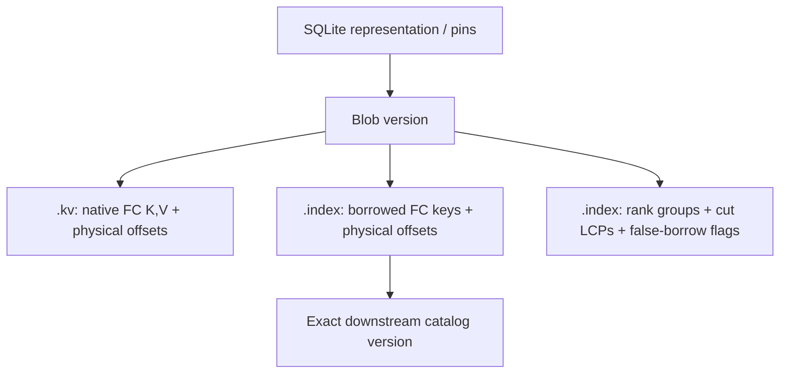

# Everett design

Updated 2026-09-16.

Start with immutable blobs and a way to merge them. Small updates can become
small blobs, and retained collections can represent persistent worlds. We can
share completed merges between those worlds, provided each reader keeps the
exact dependencies its indexes describe. This document develops that design.
Public headers are under `include/everett/`; the
[implementation ledger](implementation.md) distinguishes executable components
from the remaining storage and scheduling work.

I use ordinary front coding in both the native and borrowed streams. A search
carries a comparison against its query rather than reconstructing inherited key
prefixes. An exact LCP at each virtual sampling cut repairs the preceding
borrowed context. That small piece of index-local metadata lets native bytes
remain independent of the fractional index built over them. The
[comparison argument](comparison-fc.md) gives the detailed transfer laws;
entry, string, and I/O costs remain separate throughout this design.

## 1. Purpose and abstraction

First, some names for the intended aggregates:

- A **multiverse** owns backing storage and the immutable objects shared by its
  worlds, timelines and retained references.
- A **world** is a logical state, independent of its current physical layout.
- A **timeline** is an ordered progression of worlds.
- A **session** follows the latest world through mutable updates and equivalent
  background merges. Named sessions make that progression durable.
- A **branch point** is a retained point from which a timeline can continue or
  fork; `branch_point` is the intended API spelling.

`multiverse<P>` opens and seals objects in an existing directory; `multiverse<P>::create`
also establishes missing directory names with explicit durability barriers.
Its `connect` operation opens a [named typed session](connection.md). It exposes
`sort`, `blob`, `file`, `object_writer`, the mapped native/index/blob/query types,
`world`, `timeline` and `branch_point` associated types carrying the same policy.
`open_query` reopens a prepared exact chain from its persisted pair identity;
[mapped blobs](mapped-blobs.md) describes the portable sections and ownership. The [sealing primitive](object-writer.md)
uses reserved identities. The [SQLite component](sqlite-catalog.md) publishes
immutable timeline generations, saves and forks with exact root pins. The
`world` and `timeline` aggregate types are still forward declarations; the
semantic oracle is `reference_world`. The [catalog design](catalog.md) extends
that metadata owner to merge jobs, checkpoints and pin retirement.

A world is represented by a small collection of immutable, memory-mappable
blobs. Updates produce small new blobs; merges produce new larger blobs. A snapshot or
save pins an exact collection and the dependencies needed to query it. A save
adds durable retention to that logical snapshot; it does not define a separate
kind of application state.

The sort owns the entire record grammar, including whether it has a value at
all. FC strings are one key codec; a fixed-width integer key can occupy its known
bits without string controls. A key-only toggle illustrates an operation with no
payload, with two occurrences composing to identity. I keep toggles as an
optional experiment: their state-dependent hash accounting and validation may
cost more than the representation saves.
The registry dispatches to the record handler, while the store owns navigation,
pins and scheduling. The sort-owned profile implements mixed FC strings, raw
strings and integer keys with fixed, optional, niche and no-payload values.
The typed engine applies the same registry's hashing, read and composition
laws during admission and merge.

The outer dynamization mechanism needs a merge operation, a query operation,
and laws relating them. Maps give us one useful instance. Sort semantics supply
those operations for the typed engine. Its key space is sort-qualified: each
logical key combines a sort identity with a key interpreted by that sort's policy.
[Sorts and key policies](keys.md) specifies key units, canonical ordering,
prefix-free coding and hash-policy selection. The homogeneous byte-key encoding
below explains navigation; the [sort-owned profile](sort-profiles.md) extends
it to heterogeneous records. The general update
model allows a category chosen per full logical key: records carry composable
arrows, and omission means the identity update.
[Updates in a category chosen per key](arrows.md) specifies that
model, its nerve interpretation, and the additional cost and retention contracts.
The replacement-specific accounting below applies to ordinary string tables;
the typed runtime also executes chronological composable updates.

[Data.Vector.Map](https://hackage.haskell.org/package/structures-0.2/docs/Data-Vector-Map.html)
and
[Data.Vector.Map.Deamortized](https://hackage.haskell.org/package/structures-0.2/docs/Data-Vector-Map-Deamortized.html)
provide a functional numeral scheme for immutable merges and shared work. Here I
use **COLA-style redundant levels** in place of that initial zeroless,
mostly-oneless binary presentation.

Logical state and physical representation have different identities. Two peers
can have the same table and its composite fingerprint while retaining different
files, index versions, and completed compactions.

### Notation

| Symbol | Meaning |
| --- | --- |
| $N$ | Number of live bindings in the selected world |
| $H$ | Historical updates; distinct from live size |
| $L$ | Number of active levels/catalogs |
| $K$ | Virtual sampling interval $2^r-1$, default 15; 3, 7, 15 and 31 supported |
| $W$ | Physical codec block width, independent of $K$; defaults to $K$ |
| $A$ | Sorted native key/value stream of one blob |
| $S$ | Sorted borrowed-key stream of its fractional index |
| $C$ | Virtual sorted interleaving of $A$ and $S$ |
| $U$ | Residual extent in policy units used by an Elias–Fano encoding |
| $v$ | Fixed value width in policy units, common across the indexed stream |

For the single-route primitive below, an index targets the next catalog's
**augmented** ordering, including borrowed entries. Sampling only its native
keys would not establish the stated windows. The COLA main route follows the
same rule; its secondary route targets a native-only leaf, which has no borrowed
entries.

## 2. The blob

I first describe the single-route blob, retained by the IX02 APIs. Its logical
components need not occupy one file:

1. A front-coded array of native $(K,V)$ records.
2. A separately front-coded array of borrowed keys and routing information.
3. One `rank_groups<K>` describing their virtual interleaving.
4. Two `elias_fano` indexes, one for each physical stream.
5. One false-borrow flag per borrowed record.
6. One exact bit-LCP count per virtual cut, describing its preceding borrowed key.
7. Exact immutable target identities, physical block framing, and format information.

The [COLA extension](cola-indexes.md) adds a second borrowed stream with its own
rank, offsets, flags and cut LCPs, while sharing the same native component.



Native data remains shareable across fractional-index versions. Rebuilding an
index need not rewrite the native stream or its sampled offsets.
Pointers in persisted objects are relative positions or object references, not
process addresses. File-per-object versus managed extents remains an allocation
decision below this interface.

The byte-key instance has a specified unsigned-byte lexicographic order,
including empty keys and embedded zero bytes. Encoded records carry lengths;
zero bytes need not be reserved as terminators. General sort-qualified keys must
also satisfy the canonical ordering and framing contract in [keys.md](keys.md);
the typed registry, mixed record encoders and active read/merge dispatch all
use that contract. A fixed-width value codec can use
an explicit tombstone tag or reserve a sentinel niche in its representation.

Native keys are unique within each blob. In the categorical extension, one
entry holds a composite arrow for a consecutive portion of that key's history;
merges preserve this uniqueness. The logical table also has one configuration
per key: history occurrences are not independently mutable duplicate members.
Distinct members need distinct logical addresses to identify the old value for
deletion/replacement accounting. Indistinguishable unit-valued duplicates are
multiplicity, represented by one natural-valued binding instead of unary copies.
The [arrow design](arrows.md#logical-key-identity-and-multiplicity)
distinguishes live keys, multiplicity, and their fingerprints.

## 3. Navigation

We can work through the navigation equations with the default $K=15$.
The codecs accept a policy-selected group size;
[sampling.md](sampling.md) proves the local $K=3$ case and states the separate
chain-size and scheduler assumptions. Offset units are bytes or bits according
to the shared policy.

The policy API spells these structures `rank_groups<P::group_size>` and
`elias_fano`. `multiverse<P>::blob` uses that policy
throughout. Rank boundaries count virtual occurrences; offset checkpoints count
physical records. They need not have the same interval.
Elias–Fano stores only the chosen monotone positions. The profile layer chooses
physical samples and restores fixed value strides. The `rank_groups<15>` view shares rank15's
SIMD implementation. Groups of three use packed scalar sums; seven and thirty-one
use bounded NEON reductions on little-endian AArch64 and packed scalar reductions
elsewhere. Other group sizes use the generic class loop. These choices preserve
the same encoded classes and checkpoints.

### rank15

We assign a conceptual origin bit of one to a borrowed entry and zero to a
native entry. We only query rank at the start of an existing group:

$$
R(g)=\mathrm{rank15}(g)=
\#\{\text{borrowed entries before }15g\},\qquad 15g<|C|.
$$

Let $a=R(g)$, let $c$ be that group's stored population, and let
$e=\min(15g+15,|C|)$. Its borrowed range is $[a,a+c)$ and its native
range is $[15g-a,e-a-c)$. One rank query and one class give both boundaries,
including the final partial group; their lengths add to at most fifteen.
There is no endpoint rank entry or cached total. An empty index has no group
to query. A requested total can be derived from the final real rank and class.

A fifteen-entry population count lies in $[0,15]$, so four bits suffice.
A prefix directory then answers the boundary queries. There is no second
origin rank: native rank is virtual position minus borrowed rank.

The optional exact-position extension is the RRR class/offset idea: a class
$i$ identifies the count, and an enumerative code of
$\lceil\log_2 {15\choose i}\rceil$ bits identifies the particular pattern.
Ordinary cascading does not require that extension.
See [Raman, Raman, and Rao](https://arxiv.org/abs/0705.0552) for the general
succinct-dictionary machinery.

### Pragmatic rank-only backend

For general bitvector rank, a pragmatic layout suffices:

- One 64-bit absolute count per $2^{32}$ source bits.
- One 32-bit count relative to that epoch per 2048 source bits.
- Three packed 10-bit **individual population counts**, for the first three
  512-bit runs within the 2048-bit block.
- Sum the preceding lanes using word-parallel arithmetic; popcount the remaining
  portion of the selected 512-bit run.

The three lanes are not cumulative: a cumulative count through three full runs
could be 1536 and would not fit in ten bits. The 32-bit counter and packed lanes
fit together in 64 bits, giving 3.125% directory overhead plus the sparse epoch
counts. We only need rank from this backend; select would provide an operation
we do not use. The layout corresponds to the rank portion of
[Zhou, Andersen, and Kaminsky's Poppy design](https://www.cs.cmu.edu/~dga/papers/zhou-sea2013.pdf).

This bitvector backend and the packed fifteen-entry class stream have different
alignment requirements: 15 does not divide 512 or 2048. Its class-prefix
directory must specify its own aligned units; a class cannot answer an arbitrary
cut through its fifteen bits. The first implementation makes this distinction
explicit rather than storing unneeded origin patterns.

### Physical offsets and fixed-width values

For each stream, mark physical records $0,W,2W,\ldots$ and the end sentinel.
We store their normalized positions in policy units using Elias–Fano.
For record ordinal $i_g=\min(Wg,n)$:

$$
F_g=\mathrm{physicalOffset}(i_g)-i_gv,\qquad
\mathrm{select}_W(g)=\mathrm{base}+F_g+i_gv.
$$

The Elias–Fano universe $U$ measures the variable encoding, excluding fixed
value slots and any other fixed stride removed this way. The width $v$ must
be common to the entire indexed stream; widths fixed only within individual
sorts do not establish one global stride. The terminal sentinel uses $n$, not
$W$ times a rounded-up block count. Residual offsets may be equal; the encoding
accepts nondecreasing sequences. Borrowed records have value width zero.

With $m$ marked offsets, the representation uses approximately
$m\log_2\max(1,U/m)+O(m)$ bits plus its access support.
[Vigna's description](https://vigna.di.unimi.it/ftp/papers/QuasiSuccinctIndices.pdf)
explains the high/low-bit encoding and its use for prefix sums.
This address operation is separate from the rank-only origin backend.

A virtual window projects to arbitrary physical ordinals. For first ordinal
$i$, we find block $\lfloor i/W\rfloor$ and parse at most $W-1$ preceding
record controls, skipping payloads by length. We then process the projected
candidates in order. The two candidate counts sum to at most $K$. A nonempty
physical slice of length $m$ can cross at most
$\lceil(W-1+m)/W\rceil$ blocks; the familiar two-block bound requires
$W\ge K$. We do not reconstruct or compare the earlier physical records from
the incoming virtual boundary. These checkpoints locate and frame records;
they are not full-key restarts.

### False borrows and equality

A borrowed key also present in the native array is a **false borrow**. During
index construction, a merge of the two key streams determines a flag for every
borrowed entry. The flag belongs to that particular index version.

An equal borrowed key must not make a native value disappear behind a search
fence. On such a hit, the flag says to account for the local native binding as
well as continuing downstream routing. A native tombstone still counts as a
native occurrence. The flag does not change an entry's origin for `rank15`.

The concrete tie order and boundary recovery operation are part of the tested
query contract. A flag establishes existence; recovering the value must use
bounded ordinal/window arithmetic rather than silently starting a full search.
Tests must place the native/borrowed equality pair on both sides of a group cut.

## 4. Front coding and comparison context

I encode both streams with ordinary FC: each record retains its longest common
prefix with the previous physical key and emits the remaining suffix. Native
keys and borrowed keys have separate predecessor chains. Reindexing changes the
borrowed stream and its navigation metadata while sharing the exact native
allocation.

The first record of each physical block starts with an absolute retained-prefix
length. Other records start with a backspace relative to their physical
predecessor. The remaining fields are the same:

```text
retained_length : encoded unsigned count at block start
backspace_count : encoded unsigned count otherwise
suffix_length   : encoded unsigned count
value_length    : encoded unsigned count, omitted for a common fixed width
suffix          : suffix_length profile units
value           : value_length profile units
```

If the actual predecessor has length $a$, a backspace of $b$ retains $a-b$
units; a block's first count supplies that retained position directly. Adding
the suffix length gives the next full length. These arithmetic
operations do not require the predecessor's key contents. Byte counts use
unsigned varints. Bit backspaces use the policy's Golomb or exponential-Golomb
code; other bit counts use order-zero exponential-Golomb. A large Golomb unary
quotient can dominate the work even when the next key is short, so count
parsing is charged to the encoded controls.

The first record of the entire stream retains zero units. Later blocks can
retain arbitrarily long prefixes: the count is a position within the key, not
a full-key restart. We parse controls from the selected block's start without
reading its predecessor. `terminal_key_units` records the final full length for
sequential validation and explicit predecessor-length access at the endpoint.
Fixed-width values remove their length fields and direct payload stride from
the residual offsets; they do not influence which key prefix ordinary FC retains.

### A comparison belongs to one query

`profile_query_context<P>` owns a shared immutable query and records:

- The exact common-prefix length **in bits**, including for a byte policy.
- The compared key's full length in policy units, when known.
- Its ordering relative to the query.

Its constructor starts with the comparison of the empty key. `with_key` can
establish a context from a known key; normal cascading transfers the context
without copying that key's inherited prefix. `query()`, `common_bits()`,
`full_units()` and `order()` expose the corresponding quantities. `full_units()`
returns an optional length: reading a frame establishes it, while repairing a
strictly lower borrowed frontier can leave it unknown. A comparison
from one query cannot silently become an anchor for another.

Byte FC retains whole bytes, but two unequal bytes can share several leading
bits. Keeping an exact bit LCP avoids throwing that information away. Endpoints
remain separate. In a general comparison, full-prefix agreement needs length
information to establish equality. A known lower bound $C\le Q$ lets us do
better: agreement over all of $Q$ proves $C=Q$ without fetching $C$'s length.

### Entering a projected stream

Let $B$ be the known virtual boundary key, $A$ the physical predecessor in one
stream, and $D$ its first candidate at or after the cut. Sorted order gives
$A\le B\le D$. Every key in this interval shares the prefix retained by
$D$ from $A$. We can therefore compare $D$ using the comparison of $B$ and the
literal suffix, without reconstructing $A$ or the inherited prefix of $D$.

The stored backspace still refers to $A$'s length. It does not claim that its
retained count is the exact LCP of $B$ and $D$. For example, with actual
predecessor `aa`, boundary `ab`, candidate `abc`, and query `abd`, the stored
retained length is one byte while the boundary/query LCP is two bytes. The
candidate is below the query. Treating the retained count as an exact LCP with
the surrogate boundary would lose that result.

Physical controls before the selected lane only establish locations and full
lengths. We start comparison transfer at the selected lane; applying the
boundary comparison to earlier physical records would violate the interval
premise. After that first record, each stream advances from its actual previous
comparison. A missing predecessor uses the literal first record, and an empty
projected slice requires no forward key comparison.

### Repairing the preceding borrowed frontier

At virtual cut $q=Kg$, let $i=R(g)$ count borrowed occurrences before the cut.
If $i>0$, the preceding borrowed key is $C=S_{i-1}$. It may be the outgoing
predecessor even when no borrowed record inside the window precedes the query.
Forward comparison transfer cannot recover it from $B$, since it lies on the
other side of that boundary.

The index stores one exact scalar for this cut:

$$
\ell_g=\mathrm{lcp}_{\mathrm{bits}}(C,B).
$$

For a routed boundary, $C\le B\le Q$, so ordered-prefix convexity gives

$$
\mathrm{lcp}_{\mathrm{bits}}(C,Q)
=\min\bigl(\ell_g,\mathrm{lcp}_{\mathrm{bits}}(B,Q)\bigr).
$$

The recovered LCP spans all of $Q$ exactly when $C=Q$; otherwise $C<Q$.
This supplies its exact query comparison without reading $C$'s full length.
The borrowed predecessor is absent precisely when $i=0$, at any cut. We store
zero in that unused cut-LCP slot. Conversely, $i=|S|>0$ is a valid terminal
frontier, repaired by the same formula. A native
false-borrow match before the projected range still needs a separate value
probe at the rank-derived native ordinal; it does not need key reconstruction.

`cut_lcps()` exposes these counts as unsigned 64-bit integers, one per virtual
group. They belong to the exact index version,
including its target pair and native-before-borrowed tie order. One borrowed key
can precede several cuts with different LCPs. We retain each cut's exact count,
not a minimum shared between those cuts. The builder has both keys in its
merged-order walk and emits the scalar alongside the rank class. The keys
remain in two physical streams; there is no third interleaved key copy.

### Construction, queries, and their separate costs

`profile_blob<P>::build` and `reindex` use ordinary FC for both streams. The
streaming index builder records cut LCPs while merging native keys with incoming
samples, and emits every Kth augmented occurrence for the next stage. Reindexing
preserves native bytes and their physical offset index. Retained snapshots keep
their previous index and exact target dependencies.

`search_window(group, context)` returns the native match, when present, and a
borrowed predecessor with its query-bound `comparison`. It carries the target
ordinal and false-borrow flag alongside that comparison. The complete
`query_cursor<P>` follows exact target pins and yields every matching native
segment; it does not infer chronological arrow order from catalog order.

`query_root<P>` adds empty-native routing catalogs until its head fits in one
virtual group. Its initial comparison is against the empty key. Preparation is
paid once for that root; each query can then use the same local comparison
protocol throughout the chain. See [complete queries](query.md).

For each physical stream, navigation parses at most $W-1$ controls before its
first selected lane, then at most $K$ forward records. The two forward ranges
contain at most $K$ records in total. Cut-LCP repair and the extra false-borrow
value probe have separate bounded addressing work. With $W=O(K)$ this retains
an $O(K)$ entry/control bound per catalog. Encoded count lengths, compared
literal bits, requested values, allocation, and arrow evaluation are additional
charges; an entry budget is not a byte or I/O bound.

Sequential construction and sampling retain actual key contexts and decode each
stream in order. Arbitrary full-key reconstruction is a different operation:
ordinary FC may need to traverse an earlier prefix chain. The low-level
`profile_array` can provide opt-in locality-preserving restarts for that use,
but those restarts are not part of the blob's encoding or cascade proof.

The LPFC construction in
[Bender, Farach-Colton, and Kuszmaul, §3.2](https://people.csail.mit.edu/bradley/papers/BenderFaKu06.pdf#page=6)
is useful background for independent reconstruction through selective full-key
copies. Our query uses ordinary FC and comparison transfer instead. The
[comparison design](comparison-fc.md) and [Lean proof guide](../proof/README.md)
distinguish the checked ordered-string laws from the remaining encoded-codec,
scheduler and filesystem proof obligations.

## 5. Redundant levels and merge work

For scheduling, start with
[Cache-Oblivious Streaming B-trees, §3](https://people.cs.georgetown.edu/~jfineman/papers/sbtree.pdf).
I adopt its main/secondary/shadow arrangement and smallest-unsafe-level service
as the baseline. Data merging and lookahead construction both participate in
becoming safe and switching visibility. A main catalog routes to the next
main and terminal secondary; only the main route continues. Everett's
`cola_index` implements this topology with two borrowed FC streams and two
rank directories over one three-way virtual order. The native FC and offsets
remain unchanged. The [COLA guide](cola-indexes.md) describes construction,
queries and IX03 files.

The [scheduling model](cola-scheduling.md) separates logical unmerged slots,
root visibility and physical snapshot pins. It checks fixed-admission
transitions and slot-reuse deadlines. The [redundant runtime](redundant-runtime.md)
executes this schedule and charges native and index work on admission.
Arbitrary extra compaction, received-file
admission and persistent retention still need their corresponding bounds.

I want the store to keep $O(\log N)$ active blobs, with a bounded number per
level. Small updates pay for later merging and index construction. Work may be
performed during downtime as well as on arrivals; logical state does not depend
on the amount of compaction already completed.

The network admission design retains received content-addressed `.kv` bytes unchanged,
including their ordinary FC stream and physical sampled offsets. We build
receiver-specific fractional indexes backward over the incoming prefix and retain the old suffix.
Received `.index` objects are reusable only with matching exact source/target
versions. Native re-encoding waits for a real merge. The
[admission analysis](network-admission.md) gives the arbitrary-file-size entry
bound and identifies the remaining scheduling and variable-key-byte obligations.
Current files use reserved random identities; content addressing and network
admission are separate implementation work. No power-of-two physical-file
requirement follows from the query argument;
the original redundant-counter schedule still requires an admission proof.

There are several distinct points at which work becomes reusable:

1. A merge recipe identifies exact inputs and resolution semantics.
2. Its new native stream and sampled offsets finish.
3. A dependent pins that result.
4. The dependent completes its own borrowed stream, cut LCPs, group ranks and sampled offsets.
5. It publishes its replacement index and SQLite representation, then releases its old references.

String work needs explicit units: records visited, bytes compared, bytes emitted,
and index work. A scheduler yielding once per record can still stall on a huge
key. Continuations retain input prefix context, previous output context, cursors,
and partial comparison/write state.

We cannot assume that an input's compressed size pays for full expansion of
every string. LCP-aware merging is relevant here;
[Bingmann, Sanders, and Schimek, §II-B](https://panthema.net/2020/0518-distributed-string-sorting/2001.08516v1-Communication-Efficient-String-Sorting.pdf)
describes carrying LCP information through multiway merging and communicating
prefix-compressed strings. Everett's native merge carries predecessor comparisons
and borrows inherited prefix spans from its pinned inputs. The
[sort runtime](sort-runtime.md) describes when a semantic collision still needs
to materialize a key. Structural merge charges do not bound expanded byte work.

Elias–Fano construction also needs accounting: final record count and variable
extent can be known late. Spooling group offsets and finalizing the compact
index after the data pass is a simple initial strategy.

## 6. Snapshots, saves, and shared work

By manifest I mean the logical selection recorded by SQLite rows, with exact
immutable representation identity. There is no custom manifest/checkpoint file
format. The [catalog](catalog.md) and [file lifecycle](file-lifecycle.md) separate
transactional metadata from the `.kv` and `.index` objects it retains.

A snapshot pins the exact blob/index graph needed to read its world. A durable
save records that manifest and retains those pins across process lifetimes.
Readers hold references protecting their mappings; replacing a manifest does
not invalidate an in-flight read.

I retain a shared owner for the head, and each node owns its immediate
immutable dependencies. Sharing an already retained head increments that
reference count; it does not recursively retain the suffix again. This is
the shared-tail idea behind my
[online LCA structure](https://www.schoolofhaskell.com/user/edwardk/online-lca),
without needing its ancestor queries. A newly sealed owner records its exact
file identity and mapped counterpart, so another adapter can stop at that
acknowledged suffix. Durable catalog pins still need their own retirement
protocol; a C++ reference count alone cannot survive a process restart.

Suppose a dependent indexes old targets $X,Y$, while another branch finishes
$Z=\mathrm{merge}(X,Y)$. The dependent continues using $X,Y$: its
fractional index describes those exact layouts. It may immediately pin $Z$,
skip the data merge work it was budgeted to perform, and spend its own schedule
on index repair. Only then does it adopt $Z$.

This is **shared completion with independent adoption**. The merge can be
shared even while each fork repairs its own index on its own schedule.

Pins cover readers, saved manifests, builders, and cached results in use.
Lookup-and-retain of a cached merge must be atomic with respect to reclamation.
Construction references transfer to a published manifest before being released.
Cancellation has a corresponding release path.

### The pin-set owner

The current world has one immutable pin-set owner. Each entry records an exact
object identity, its lifetime pin, its local additive contribution, and optionally
its own-native-record fingerprint. The owner caches the sum of the contributions;
this sum is the world's composite key. A snapshot shares the owner. Updating or
compacting constructs a replacement owner without changing previous snapshots.

The contribution is defined by the entry's role: a base contributes its table
fingerprint, an update contributes its validated old-to-new delta, and a merge
contributes the sum of the entries it replaces. A tombstone-only update can have
zero native fingerprint and a nonzero negative contribution. Section 8 defines
the algebra. Index-only dependencies retain objects but contribute no bindings.

Physical replacement checks that all expected input identities are present and
that the replacement contribution equals their sum before publishing the new
owner. Equality of this weak sum is a lint check, not proof that a merge is
correct. Record precedence and exact index dependencies must also be preserved.
An in-memory shared pointer provides lifetime safety; durable saves additionally
need a persisted root and recovery protocol.

### Durability and resumption

A failed durability barrier must leave the last acknowledged save recoverable.
A completed merge is therefore initially a candidate output. We make its
contents and object-store metadata durable, then publish a durable manifest that
references it, and only then retire the old root's pins. Other snapshots,
readers, index dependencies and resumable jobs can still retain the old inputs.

Resumable work has its own state. A merge checkpoint names its
exact recipe and immutable inputs, input positions and prefix contexts, a
verified output prefix, and the state needed to resume output encoding and index
construction. Checkpoint publication must follow the durable bytes it describes.
If no trustworthy checkpoint survives, recompute from the retained inputs.

An `fsync` error means the durability assertion failed. We retain the old
durable root and inputs, quarantine uncertain output, and report the failed save
or checkpoint. A later successful `fsync` alone does not justify releasing
those pins or claiming durability.
The detailed protocol, filesystem assumptions and failure tests are specified in
[Durability and merge resumption](durability.md).

A merge cache key includes exact inputs plus any precedence, format, or
tombstone-elision context affecting the output. If elision requires coverage of
older records outside the inputs, include that coverage in the recipe or retain
the tombstone in the reusable result.

The logical fingerprint is not the identity of a particular physical layout.
Immutable object identities and format versions serve that purpose.

## 7. Strong deletes and live-universe rebuilding

For replacement-valued records, we can give a concrete cleanup rule.
Arbitrary arrows require a category-specific clean representation and work bound;
materializing an endpoint must preserve every supported future observation and
update before history can be forgotten. See the
[categorical extension](arrows.md#6-blobs-pins-checkpoints-and-strong-deletion).

I use the weak-to-clean update transformation in **Overmars and van Leeuwen,
§2, Theorem 1**, adapting its OLD-MAIN, MAIN and buffered-update roles to immutable
manifests. Their November 1980 report is RUU-CS-80-10; the journal publication
appeared in 1981.
[Author report](https://ics-archive.science.uu.nl/research/techreps/repo/CS-1980/1980-10.pdf#page=5);
[journal DOI](https://doi.org/10.1016/0020-0190(81)90093-4).
The [rebuild protocol](rebuild.md) gives the accounting and adaptation
in detail. Global rebuilding is separate from ordinary COLA level merges.

Native records represent $(K,\mathrm{Maybe}\,V)$; `Nothing` is a tombstone.
Newer records shadow older records. A genuine delete requires knowing that the
old binding existed. An absent-key tombstone earns no deletion credit. We count
live bindings separately from weak mutations: overwrites also grow physical history
and must contribute to the cleanup schedule.

### Generation state and trigger

Each generation records its clean base cardinality $b$ and the number $u$
of admitted key mutations since that base's freeze cut. **Replayed mutations
count toward $u$**. I choose to start rebuilding at
$u\ge\lfloor b/4\rfloor$, early enough to finish before half the base could disappear.
These constants are our adaptation, not the constants printed in the paper.
Tiny generations use a bounded direct rebuild rather than fractional counters.

1. **Freeze.** We pin a complete world manifest at an admitted update cut and keep
   the serving generation current while this pinned source remains unchanged. Let
   $n_s$ be the source's live cardinality.
2. **Build clean contents.** We merge the frozen native streams with full older
   coverage, emitting only each key's newest live binding. We discard the frozen
   tombstones and shadowed versions, and construct the replacement's fractional
   indexes against its exact new catalogs.
3. **Capture and replay.** Every later admitted mutation updates the serving
   generation and enters an ordered replay queue. After clean construction,
   we apply that queue to the replacement, retaining causal order for each key.
   Queries continue using the serving generation throughout.
4. **Catch up and adopt.** When the queue is empty at an admitted cut and all
   replacement indexes are ready, we compare live count and composite fingerprint,
   then publish the new owner. The new counters are $b=n_s$ and
   $u=\text{replayed mutations}$, not zero. Durable adoption follows the
   publication protocol; other snapshots keep their old pins.

### Why catch-up finishes

Let $R$ bound the complete frozen rebuild work. We choose a deadline of
$h=\lfloor n_s/8\rfloor$ admitted key mutations. Mutation $i$ requires at
most $w_i$ work to replay, including its replacement-side merge/index work.
In addition to applying it to the serving generation, we give the background job
$R/h+w_i$ work. We spend this on construction until construction finishes, then
on FIFO replay. Its unfinished work decreases by at least $R/h$ per admission
until it reaches zero. Thus the queue is caught up by $h$, without assuming
that a late, arbitrarily large replay pass will somehow finish.

At adoption, replay debt is at most $\lfloor n_s/8\rfloor$, below the next
generation's $\lfloor n_s/4\rfloor$ trigger. There is fresh slack for the next rebuild. Counting individual
key mutations makes this argument apply to large changeset blobs; counting each
whole blob as one update would not fund its work.

The result is an active represented universe within a constant factor of live
$N$, so the level bound follows live size instead of lifetime update count.
New mutations can introduce new tombstones while a rebuild is running; the
claim is timely removal of accumulated history, not a simultaneously
mutation-free physical image at every publication cut. Repeated overwrites
trigger the same rebuilding mechanism even when live cardinality is unchanged.

For strings, $R$ includes actual scanning, reconstruction, output, index and
checkpoint work. It must cover the frozen physical representation, not just
count live keys. A long unchanged key can make $R/h$ large even when the
incoming deletions are short. The scheduler needs explicit byte/work budgets;
the unit-record theorem alone does not prove a byte-cost bound for our encoding.
Storage failures can stop progress and require admission backpressure, as
specified in the durability protocol. Historical pins retain old bytes
legitimately and are reported separately from the active universe.

## 8. Composite key / algebraic fingerprint

Let our hash functions take values in an algebra $R$, and define:

$$
h_V(\mathrm{Nothing})=0,\qquad
C(T)=\sum_{(k,v)\in T}h_K(k)\,h_V(v).
$$

Replacing a binding contributes

$$
\Delta(k)=h_K(k)\,[h_V(v_{\mathrm{new}})-h_V(v_{\mathrm{old}})].
$$

The implementation needs zero, addition, additive cancellation, and
multiplication; **no division**. Suitable choices include a finite field, a
prime field, arbitrary integers, or explicitly wrapping unsigned arithmetic.
For characteristic-two fields subtraction is addition. Signed integer overflow
is not an implementation of integer arithmetic.

We must encode hash inputs consistently and record the algebra/hash scheme in
the format or session definition. Sort-code bits are not hashed. Each sort
can select key and value hash policies, while the value potential may additionally
depend on the full key's category. All contributions enter the same additive
algebra, and the pinned schema fixes policy versions; see [keys.md](keys.md).
The initial test policy may use wrapping
$\mathbb Z/2^{64}\mathbb Z$; the store interface must not require multiplicative
inverses.

The composite key is a sanity fingerprint of the resolved table. It is invariant
under compaction, reassociation of independent updates, and native/index layout
changes. It detects differing results without requiring peers to have the same
physical representation; collisions are possible by design.

Three quantities now need to be distinguished:

- A physical object's checksum/identity.
- A fingerprint of a file's own native records.
- The algebraic delta of a changeset relative to validated old bindings.

Borrowed entries never contribute world contents. Overlapping own-record file
fingerprints are not simply additive: shadowed bindings require cancellation.
A tombstone's zero value does not by itself subtract an older contribution.

For a category chosen per key, we use a local state potential $\phi_k$ and assign
an arrow $f:x\to y$ the delta $\phi_k(y)-\phi_k(x)$. Composition telescopes,
so the same pin-owner sum applies. This is an exact additive 1-cocycle; zero delta
does not imply an identity arrow. Obtaining the target potential cheaply is an
additional policy obligation. The [arrow design](arrows.md) gives
the construction and distinguishes endpoint fingerprints from history.

## 9. Partitioned world rounds

For round $t$, all workers read the same immutable base $W_t$. A partitioning
function assigns each writable key to exactly one owner for that round. This can
be ranges, bins, or another specified function; it need not be a permanent
physical sharding of the store.

Each worker performs its expensive computation against the base and emits a
sorted changeset for a subset of its assigned keys. A changeset carries the
round/base reference, owner/partition identity, old/new bindings or equivalent
validation evidence, an operation identity, and its fingerprint delta.

For disjoint write sets:

$$
\mathrm{apply}(D_a,\mathrm{apply}(D_b,W_t))
=\mathrm{apply}(D_b,\mathrm{apply}(D_a,W_t)),
$$

$$
C(W_{t+1})=C(W_t)+\sum_j\Delta(D_j).
$$

Arrival order is not precedence for overlapping writes. Updates to the same key
across rounds retain their semantic ordering. Same-round overlap violates the
partition contract and must be rejected or handled by a separately specified
resolution rule. Empty changesets are valid. Duplicate delivery must not apply
the same delta twice.

After all required changesets have been admitted, we advance to $W_{t+1}$.
Intermediate application can take any order while the read base remains pinned.
Changing assignment for the next round does not change the table's composite key.
Transmitting changesets is independent of the temporary computation used to
produce them.

The store establishes disjoint-write commutativity. It does not establish the
validity of arbitrary application-level cross-key invariants; those belong to
how the round assignments and computations are defined.

This commutativity also holds when keys use different categories: extend each
key's arrow by identities at the other keys, then compose componentwise. Each
same-key chain must remain composable and chronologically ordered.

## 10. Bounds and acceptance

I target an active level count of $O(\log N)$, contingent on completed
live-size accounting. After root preparation, a cascade examines $O(K+W)$
entries/controls per catalog, including its bounded frontier/value probes. For
fixed $K$ and $W$, this is $O(L)$ navigation work. Literal comparison work is
bounded separately by the query length and records visited; count parsing must
also include the selected codeword lengths. I accept repeating query-prefix
work across levels, without requiring full inherited keys to be reconstructed.
The prepared root bounds bootstrap work; it does not prove that an arbitrarily
deep received chain satisfies the level invariant.

With arbitrary update arrows, these are navigation bounds. Arrow access,
composition and observation add their own costs. Constant-time construction of
a composite expression does not establish constant-time evaluation or bounded
retained history. A logarithmic total bound requires explicit policy contracts.

Space accounting separately reports native key encoding, fixed values, borrowed
keys, false-borrow bits, rank metadata, both offset indexes, exact cut-LCP
counts, physical block framing, unfinished outputs, and objects retained only by historical pins.
The redundant schedule budgets approximately $3\log_2(N+1)$ live indexes for
one snapshot and another $3\log_2(N+1)$ during rebuilding, with a constant-size
base case. A repeated first borrowed key of length $T$ therefore contributes
$O(T\log(N+1))$ simultaneous literal units across those indexes. More generally,
their total key literals are bounded by the index count times the ordinary-FC
literal size of the retained native key union. These are per-snapshot storage
bounds; historical pin unions and cumulative construction work have separate
accounting. The [network storage analysis](network-admission.md) gives the details.
The ordinary front-compression size of the global logical union is not the sum
of independently encoded files; prefix duplication across runs is real.
We cannot transfer the COSB-tree's complete optimal I/O theorem to this composition.

I require the implementation checks to include:

- Rank/class counts against a simple oracle; tails and all-ones 512-bit runs.
- EF repeated offsets, large gaps, normalized fixed strides, and partial tails.
- Empty, binary, prefix-related, and long-prefix strings.
- False borrows and equality exactly across virtual and physical group cuts.
- First-record comparison with a boundary different from the true predecessor.
- Exact cut LCPs, absent/terminal borrowed frontiers, and query-bound contexts.
- Independent K/W boundaries, control-only pre-lane parsing, and bounded loads.
- Every permutation of small disjoint partition batches gives equal resolved
  records and composite keys.
- Delete/overwrite deltas match full recomputation; absent deletes earn no credit.
- Snapshots and forks remain unchanged after updates and compactions.
- Reused merge outputs leave old dependent indexes readable until adoption.
- Immutable-file sealing, publication/recovery, and mmap lifetime across unlink.

## 11. References and their roles

1. **Edward A. Kmett, structures 0.2.**
   [Hackage](https://hackage.haskell.org/package/structures) and
   [source repository](https://github.com/ekmett/structures).
   The original functional dynamization starting point.
2. **M. A. Bender, M. Farach-Colton, J. T. Fineman, Y. R. Fogel,
   B. C. Kuszmaul, and J. Nelson. Cache-Oblivious Streaming B-trees.**
   SPAA 2007, pp. 81–92.
   [DOI](https://doi.org/10.1145/1248377.1248393);
   [author PDF](https://people.cs.georgetown.edu/~jfineman/papers/sbtree.pdf).
   Redundant COLA scheduling and lookahead maintenance.
3. **M. A. Bender, M. Farach-Colton, and B. C. Kuszmaul.
   Cache-Oblivious String B-trees.** PODS 2006, pp. 233–242.
   [DOI](https://doi.org/10.1145/1142351.1142385);
   [author PDF](https://people.csail.mit.edu/bradley/papers/BenderFaKu06.pdf).
   String locality, front compression, and LPFC for independently decoded data.
4. **B. Chazelle and L. J. Guibas. Fractional Cascading: I. A Data
   Structuring Technique.** Algorithmica 1, 1986, pp. 133–162.
   [author PDF](https://www.cs.princeton.edu/~chazelle/pubs/FractionalCascading1.pdf);
   [Part II](https://www.cs.princeton.edu/~chazelle/pubs/FractionalCascading2.pdf).
   The multi-catalog search idea; our rank/count representation replaces the
   usual explicit bridge layout.
5. **R. Raman, V. Raman, and S. S. Rao. Succinct Indexable Dictionaries
   with Applications to Encoding k-ary Trees, Prefix Sums and Multisets.**
   [author preprint](https://arxiv.org/abs/0705.0552).
   Optional enumerative patterns beyond the fifteen-entry count classes.
6. **S. Vigna. Quasi-Succinct Indices.** WSDM 2013.
   [author PDF](https://vigna.di.unimi.it/ftp/papers/QuasiSuccinctIndices.pdf).
   Practical Elias–Fano representation of monotone offsets and prefix sums.
7. **D. Zhou, D. G. Andersen, and M. Kaminsky. Space-Efficient,
   High-Performance Rank & Select Structures on Uncompressed Bit Sequences.**
   SEA 2013.
   [author PDF](https://www.cs.cmu.edu/~dga/papers/zhou-sea2013.pdf).
   The specified practical rank directory; its select algorithm is not a
   requirement for the rank-only backend.
8. **T. Bingmann, P. Sanders, and M. Schimek. Communication-Efficient
   String Sorting.** 2020.
   [author PDF](https://panthema.net/2020/0518-distributed-string-sorting/2001.08516v1-Communication-Efficient-String-Sorting.pdf).
   Relevant additional work for LCP-aware compressed merges and partitioning.
9. **A. Twigg. Persistent Cache-oblivious Streaming Indexes.** 2017 preprint.
   [paper](https://arxiv.org/abs/1707.08186).
   Relevant comparison for version-sensitive space and update accounting.
   Its persistence and averaged range-query guarantees are not automatically
   guarantees for our fully branching pin/adoption model.
10. **M. H. Overmars and J. van Leeuwen. Worst-case optimal insertion and
    deletion methods for decomposable searching problems.** Information
    Processing Letters 12(4), 1981, pp. 168–173.
    [DOI](https://doi.org/10.1016/0020-0190(81)90093-4);
    [November 1980 author report RUU-CS-80-10](https://ics-archive.science.uu.nl/research/techreps/repo/CS-1980/1980-10.pdf).
    Section 2, Theorem 1, printed
    pp. 3–4 (PDF pages 5–6), gives the weak-to-clean update transformation.
    Our earlier trigger constants and immutable-manifest adaptation are explained
    in the [rebuild protocol](rebuild.md).

I collect filesystem references and failure-model evidence in the
[durability protocol](durability.md).

Ferragina and Grossi's
[The String B-Tree](https://www.inf.fu-berlin.de/lehre/SS01/biodaten-seminar/papers/String-B-tree.pdf)
provides additional string-index background. Bender, Farach-Colton, and
Kuszmaul's 2006 COSB-tree paper supplies the LPFC reference; the blob and cascade
described here use ordinary FC with exact comparison context.
